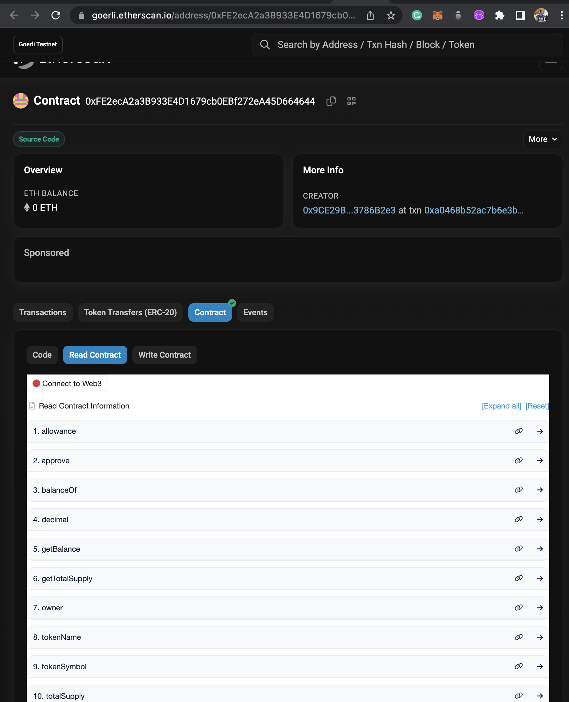

# ERC20 Token without Librabry

## Web3Bridge Assignment

## Contents
- Introduction
- Screenshots
- Language
- Function Interactions

### Introduction.
This project demonstartes how you can create an ERC20 token from scratch without using any library. it features token transfers by token owners and proxy transfer by given someone else permission to spend your token. it also includes other features like the burn and mint functions.

### Screenshots
#### Verified on Etherscan

### Languages
- Solidity
- TypeScript

### Function Interactions
- transfer function
- transferFrom Function
- mint Function
- _approve Function
- _allowance Function
